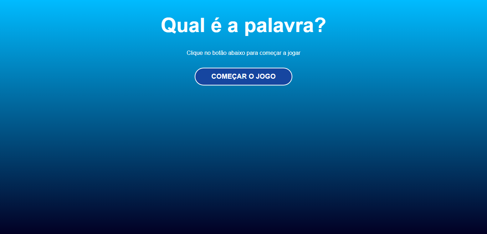
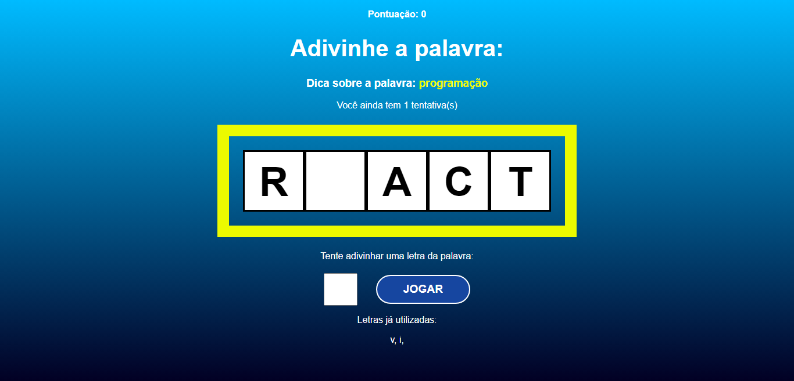
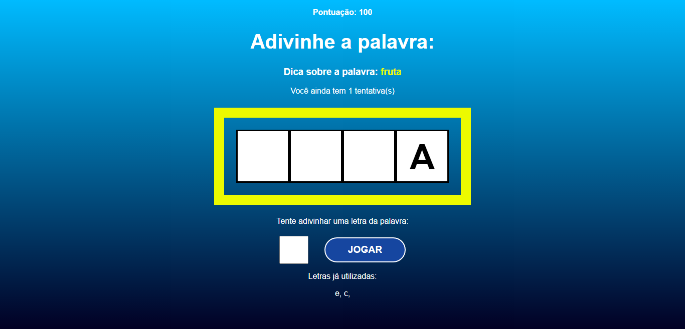
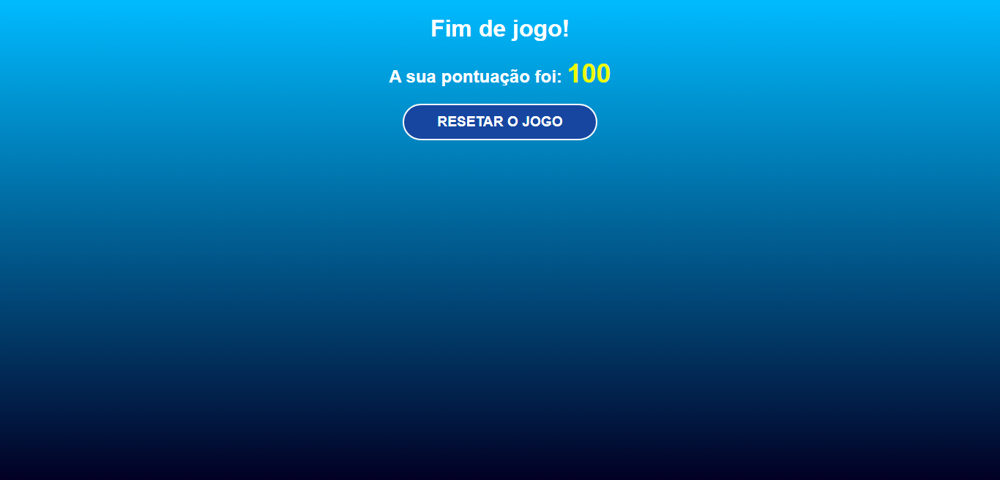

# Jogo - Qual é a palavra?

## 💻 Sobre

Projeto desenvolvido em React com o objetivo de consolidar meus conhecimentos no Framework, você pode conferir e jogar através do link! https://qual-e-a-palavra-jade.vercel.app/

<h3 align="center">
⚙️ Tecnologias utilizadas

&nbsp;

</h3>

---

## 🚧 Projeto

<h3 align="center">
  

  	
</h3>

<h3 align="center">
  

  	
</h3>

<h3 align="center">
  

  	
</h3>

<h3 align="center">
  

  	
</h3>

---

## ✒️ Autor

| [    Cherlau Prado ](https://github.com/cherPrado) |
| :--------------------------------------------------------------------------------------------------------------------------------------------: |

<h2 >Entre em contato 🤙🏽</h2>

